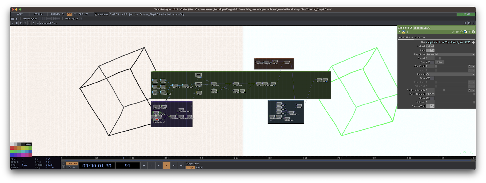

# Workshop - Touchdesigner 101:

## Step 0

* Mit UI/Terminologie/Konzepten vertraut machen

## Step 1 - Handdrawn Lines

* Visuelles Beispiel mit Kernkonzepten:
* * Rendering
* * TopologieOperatoren
* * Operatoreninteraktion/Referenzierung

Basiskonzept von [Bileam Tschepe](https://www.youtube.com/watch?v=WpkOVI3f6Yk)

## Step 2 - Interaktivität 1

* ChannelOperatoren und gestreamte Daten
* Analyse und Interaktion von Komponenten

## Step 3 - Interaktivität 2

* Metainformationen
* Operatorenkonvertierung

## Step 4 - Programmierinterface

* Skripte ausführen
* Operatoren mit Skripten beeinflussen
